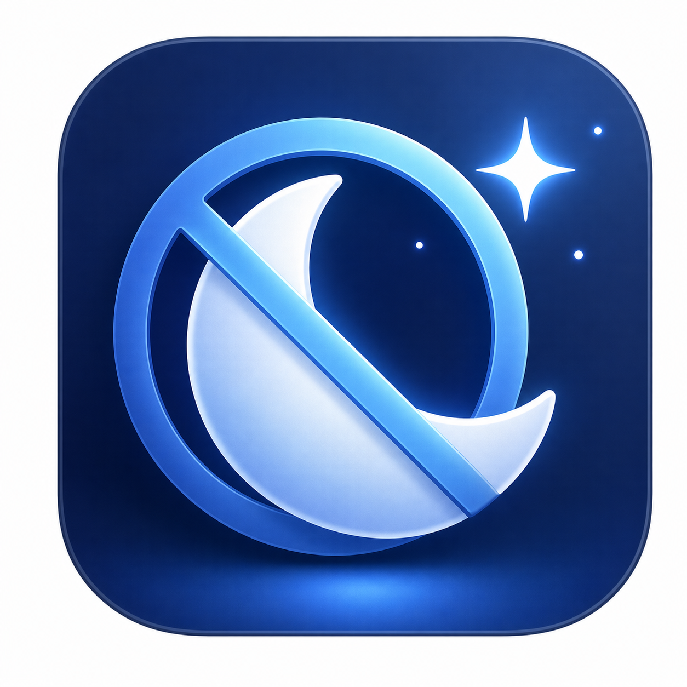

<p align="center">
  
</p>

<h1 align="center">NoNap</h1>

<p align="center">
  A small macOS menu bar app that keeps your Mac awake when you need it.
</p>

NoNap prevents macOS from going to sleep due to inactivity with a simple menu bar toggle. It can run indefinitely or for a fixed duration, and it can optionally keep the display awake too.

> [!NOTE]
> NoNap is a spare-time project. I do not currently have a paid Apple Developer Program membership to sign and notarize the app, so macOS may block the first launch and require a manual confirmation in `Privacy & Security`.

## Features

- Menu bar only app: no Dock icon, no main window.
- Prevents automatic system sleep while active.
- Optional `Keep Display On` mode.
- Built-in duration presets: indefinitely, 15 minutes, 30 minutes, or 1 hour.
- Countdown status in the menu while a timed session is active.
- Optional startup at login.
- Release builds are packaged as a DMG.

## Requirements

- macOS 14.0 or later to run the app.
- Xcode is only required if you want to build the app from source.

## Installation

1. Download the latest `NoNap-macOS.dmg` from a GitHub release.
2. Open the DMG.
3. Drag `NoNap.app` into `Applications`.
4. Open the app from `Applications`.

Because the app is not signed with an Apple Developer account, macOS may show a warning that it cannot verify the developer or check the app for malicious software. If that happens:

1. Try to open `NoNap.app` once.
2. Open `System Settings`.
3. Go to `Privacy & Security`.
4. Scroll down to the `Security` section.
5. Click `Open Anyway` for NoNap.
6. Confirm with `Open` and enter your password if macOS asks for it.

After that, macOS saves NoNap as a security exception and you can open it normally by double-clicking the app.

> [!WARNING]
> Only override macOS security settings if you trust the source of the app. Apple recommends caution when opening apps that have not been signed and notarized.

Apple reference: [Open an app by overriding security settings](https://support.apple.com/guide/mac-help/open-an-app-by-overriding-security-settings-mh40617/mac)

## Usage

1. Open NoNap from the menu bar.
2. Enable `Activate` to keep your Mac awake.
3. Choose a duration, or leave it set to `Indefinitely`.
4. Enable `Keep Display On` if the display should stay awake too.
5. Disable `Activate`, wait for the timer to expire, or quit the app to release the power assertions.

## Start at Login

In the NoNap menu, enable `Open at Login`.

If macOS says the login item needs approval:

1. Open `System Settings`.
2. Go to `General > Login Items & Extensions`.
3. Find NoNap in the login items list.
4. Approve or enable NoNap.

After that, NoNap starts automatically when you log in to macOS. It opens in the menu bar; enable `Activate` when you want it to keep your Mac awake.

## Build from Source

Open `NoNap.xcodeproj` in Xcode and run the shared `NoNap` scheme.

You can also build from Terminal:

```sh
xcodebuild \
  -project NoNap.xcodeproj \
  -scheme NoNap \
  -configuration Debug \
  -derivedDataPath build \
  CODE_SIGNING_ALLOWED=NO \
  build
```

Run the built app:

```sh
open build/Build/Products/Debug/NoNap.app
```

## Releases

GitHub Actions builds `NoNap-macOS.dmg` on pushes to `main`, pull requests, manual workflow runs, and version tags.

To publish a release, create and push a version tag:

```sh
git tag v1.0.0
git push origin v1.0.0
```

The workflow builds the app, applies an ad-hoc signature, packages the DMG, uploads the artifact, and attaches `NoNap-macOS.dmg` to the GitHub release for tags that start with `v`.

## Verify Power Assertions

While NoNap is active, run:

```sh
pmset -g assertions
```

You should see a `PreventUserIdleSystemSleep` assertion named `NoNap is keeping your Mac awake`. If `Keep Display On` is enabled, you should also see a `PreventUserIdleDisplaySleep` assertion named `NoNap is keeping your display awake`.

Both assertions are released when NoNap is deactivated, when the timer expires, or when the app quits.

## Project Structure

```text
NoNap/
  NoNapApp.swift           SwiftUI menu bar UI
  NoNapManager.swift       IOKit power assertion lifecycle
  NoNapDuration.swift      Duration presets
  LoginItemManager.swift   Open at Login integration
  Info.plist               App metadata and menu bar mode
  NoNap.icns               App icon

.github/workflows/
  build.yml                CI, DMG packaging, and tag-based releases
```
